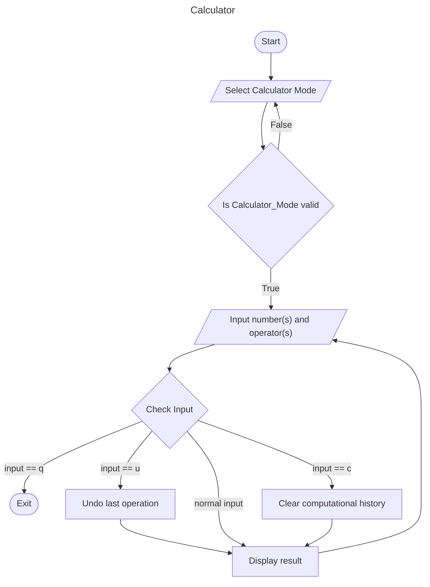

```mermaid
---
title: Calculator
---
flowchart TD
    
    Start([Start])
    Calculator_Mode[/Select Calculator Mode/]
    Mode_Decision{Is Calculator_Mode valid}
    Calculator_Input[/"Input number(s) and operator(s)"/]
    Input_Decision{Check Input}
    Exit([Exit])
    Undo[Undo last operation]
    Display[Display result]
    Clear[Clear computational history]

    Start --> Calculator_Mode
    Calculator_Mode --> Mode_Decision
    Mode_Decision -- False --> Calculator_Mode
    Mode_Decision -- True --> Calculator_Input
    Calculator_Input --> Input_Decision
    Input_Decision -- input == q --> Exit
    Input_Decision -- input == u --> Undo
    Undo --> Display
    Input_Decision -- normal input --> Display
    Input_Decision -- input == c --> Clear
    Clear --> Display

    Display --> Calculator_Input


    


```